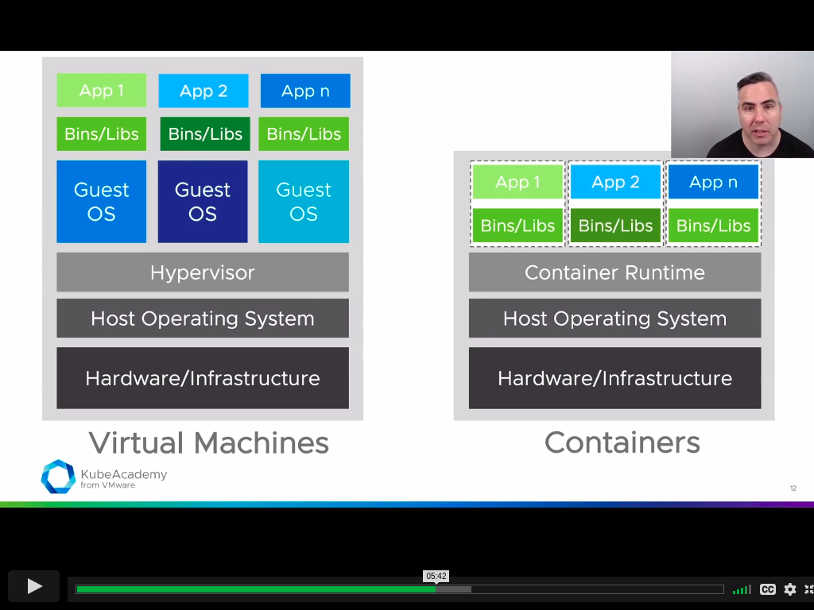
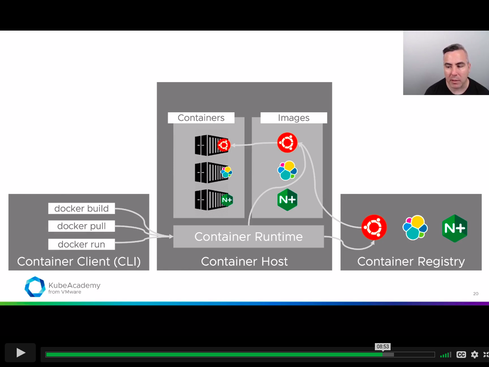

# what is containers?

IRL:

> containers are a standardized way for you to package items together into one shipment.

shipping containers:

- standard packaging
  - isolation and efficiency
- portable
- separation of concerns

IVL:

> containers are a standardized way for you to package your application, its configuration and dependencies together into a single logical object

virtual containers:

- standard packaging
  - isolation & efficiency
- portable
- separation of concerns

linux kernel features:

- namespaces - namespace allow os limit what process can see such processes, file system etc.
- control groups (cgroups) - limit how much process can use like cpu, memory etc.

To computers:  
A contaienr is a process extracted from tarballs anchored to namespaces and controlled by cgroups.

# concepts behind kubernetes

- declarative vs imperative
- control loops
- reconciliation

### declarative vs imperative

declarative - describes desired state  
imperative - tell about action that needs to be done

### control loop

### reconciliation

- reconciliation is simply making the actual state look like the desired state via the control loop
- occurs in numerous places throughout kubernetes
  - `kubectl apply -f file.yaml`
