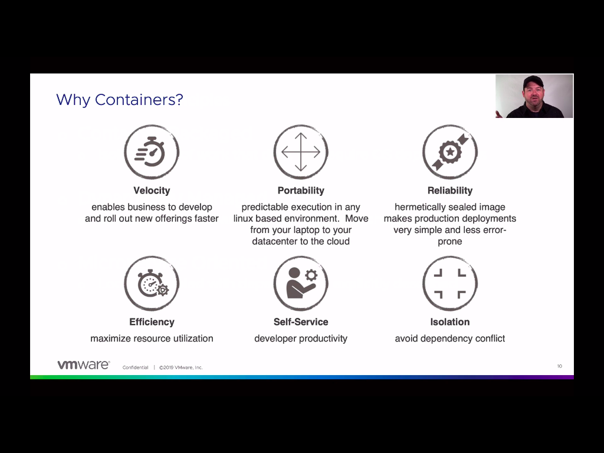

# Cloud Native Principles

- container Packaged
  - isolated unit of work that does not require os dependencies

## image vs container

- an image is the result of a build
- a container is a running instance from an image

## starting and stopping containers

- docker run
  - start a new container from an image
- docker stop
  - stop a running container
- docker rm
  - delete a container (must be stopped)
  - add -f to both stop and remove a container

## managing images

- docker images
  - display a list of images on the machine
- docker rmi
  - delete an image
- docker build
  - build an image from a dockerfile
- docker tag
  - add tags to an image
- docker pull/push
  - pull and push images to/from a registry

## docker troubleshooting commands

- docker ps
  - retrieve a list of running containers
  - add -a to include non-running containers
- docker logs
  - view a containers log output
- docker exec
  - run a command within a container
  - can also start a shell within a container (if available)

## container registry

- a container registry provides a central location for container image storage
- types of registries
  - hosted: docker hub, google container registry
  - self-hosted: artifactory, harbor, quay
- images are built on a build host and pushed to a registry.

# cloud Native principles

- dynamically managed
  - actively scheduled and managed by an orchestration process
- microservice oriented
  - loosely coupled with dependencies explicitly described

## kubernetes concepts

- pods
- services
- deployments

### why pods?

- legacy applications
  - new apps have luxury of implementing many features within the app
- separation of concerns
  - isolate logic and changes to different apps
- reusability
  - if designed appropriately containers can be re-used by different apps

### pods characteristics

- one or more containers per pod
  - the pod's existence/purpose is usually because of one particular container
- assumptions
  - all containers for a pod will run on the same node
  - containers within a pod can talk to each other over localhost
  - containers can share volume resources

### services

- load balancing for pods
- use labels to determine target pods

### deployments

- single object that will create other resource
- pod spec is nested
- leverages selectors
